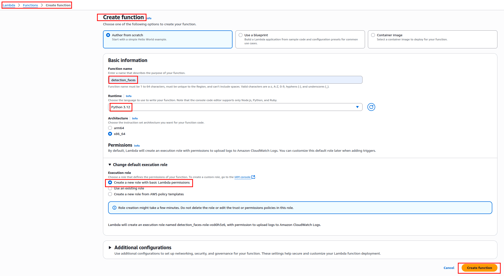
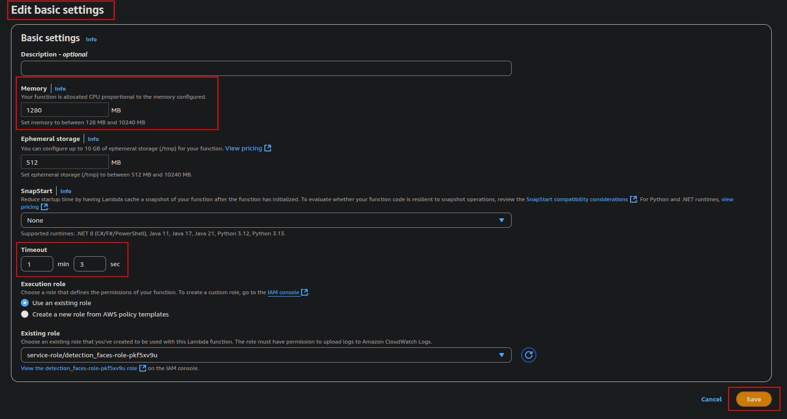
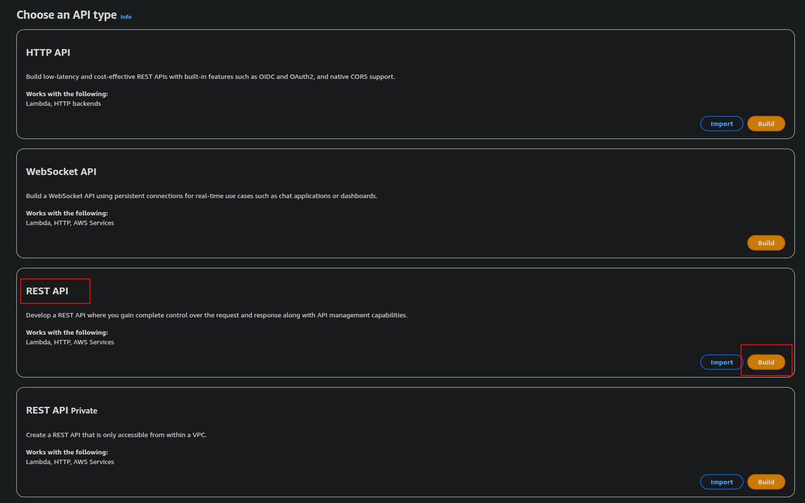
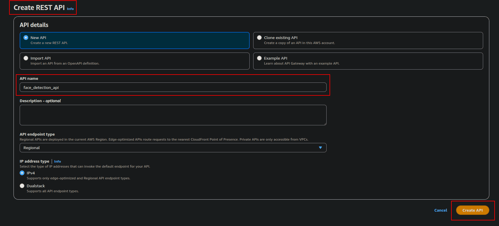
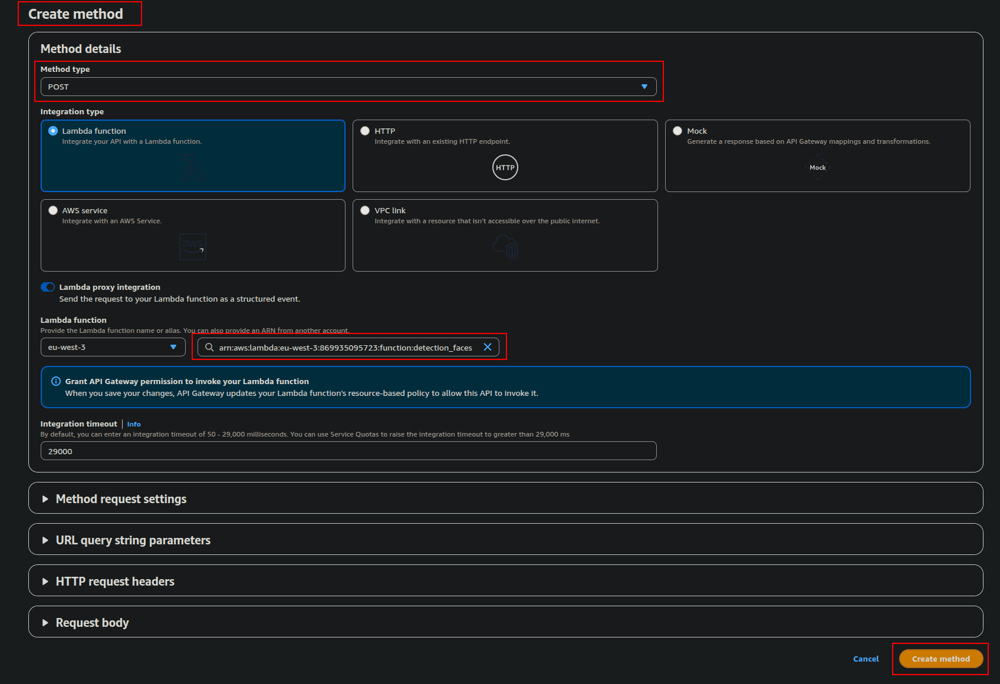
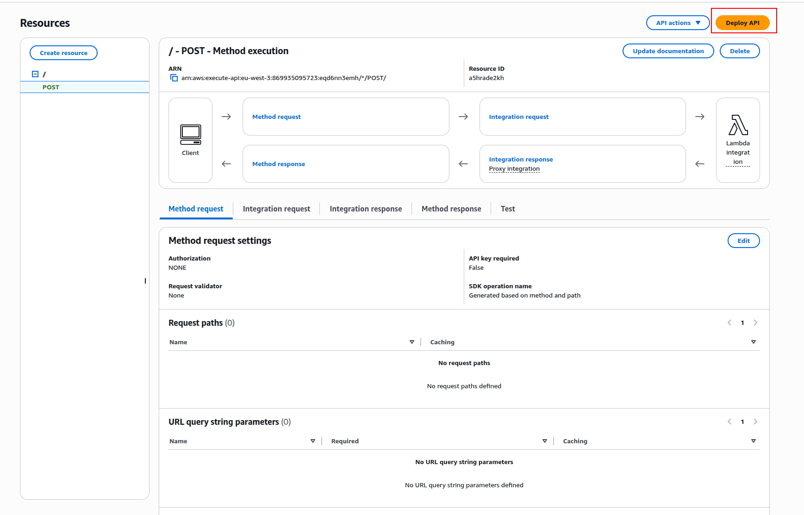
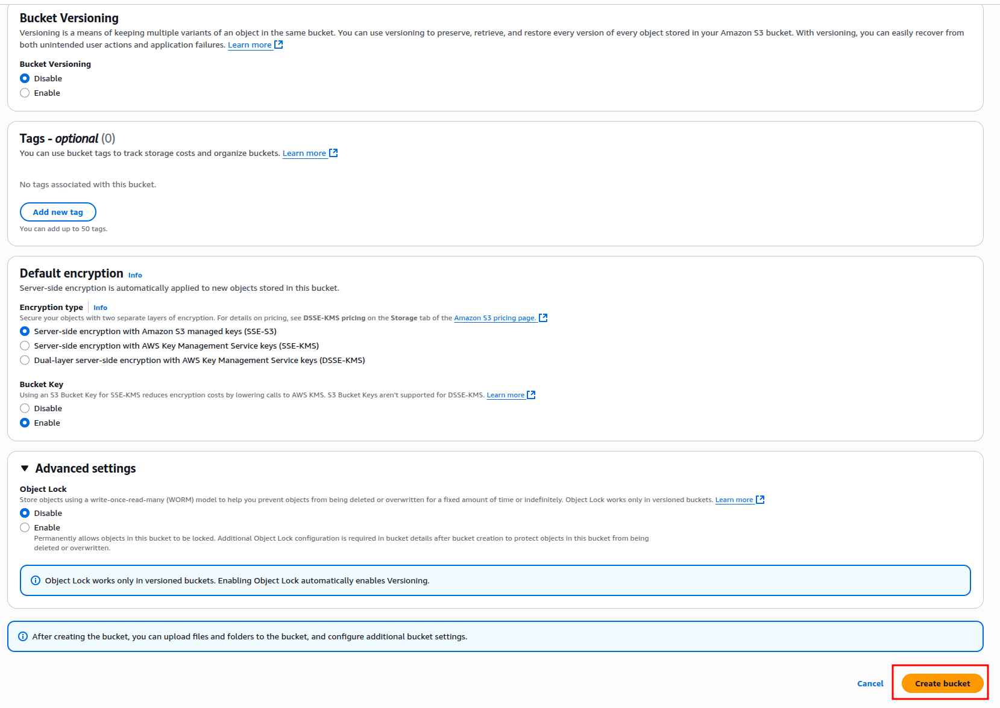

# 🖼️ Detector de Caras en AWS

Este proyecto implementa un sistema **serverless de detección de caras** usando **AWS Lambda**, **API Gateway**, **S3** y **DynamoDB**, junto con la librería **OpenCV**.  
Permite enviar imágenes a través de una API REST, detectar rostros y almacenar tanto las imágenes como las coordenadas de los rostros detectados en la nube.

## 📊 Arquitectura

**Flujo de datos:**
1. El usuario envía una imagen mediante **API Gateway**.  
2. **Lambda** procesa la imagen con **OpenCV** y detecta los rostros.  
3. Los resultados se guardan en **DynamoDB** (coordenadas) y la imagen en **S3**.  
4. Los logs y errores se registran en **CloudWatch**.  
5. **IAM** y **EC2** se usan como soporte para permisos y generación de layers.

---

## 🛠️ Tecnologías utilizadas

- **AWS Lambda**  
- **Amazon API Gateway**  
- **Amazon S3**  
- **Amazon DynamoDB**  
- **AWS IAM** (gestión de roles y permisos)  
- **Amazon EC2** (para generar el layer de OpenCV)  
- **Python 3.12**  
- **OpenCV**  

---

## ✨ Características

- API REST para enviar imágenes.  
- Procesamiento serverless en Lambda.  
- Detección de rostros con **OpenCV (Haar Cascade)**.  
- Almacenamiento seguro de imágenes en S3.  
- Guardado de coordenadas en DynamoDB.  
- Monitoreo de ejecución con CloudWatch.  

---

## 🧩 Paso 1 — Crear la función Lambda

### 📘 Descripción
En este paso se crea una función **AWS Lambda** desde cero dentro del entorno educativo de **AWS Educate / AWS Academy**.  
Dado que las cuentas *Student Lab* no poseen privilegios para crear o gestionar roles de IAM, se utiliza un **rol preasignado** denominado *LabRole* (o equivalente).

---

### 🧠 Configuración en la consola

1. Accede al servicio **AWS Lambda**.
2. Haz clic en **Create function**.
3. Selecciona la opción **Author from scratch**.
4. Completa los campos de la sección **Basic information**:
   - **Function name:** `detection_faces`
   - **Runtime:** `Python 3.12`
   - **Architecture:** `x86_64`
5. En la sección **Permissions**, selecciona:
   - **Create a new role with basic Lambda permissions**

---

### 🖼️ Referencia visual

---

## Paso 2 — Configurar los parámetros básicos de la función Lambda

### 🧩 Descripción
En este paso se ajustan los **parámetros básicos de ejecución** de la función Lambda para optimizar el rendimiento y evitar interrupciones por falta de memoria o tiempo de ejecución.  
La configuración se realiza desde la sección **Edit basic settings** de la consola AWS Lambda.

---

### ⚙️ Configuración en la consola

1. Accede a la función **`detection_faces`** previamente creada.  
2. Haz clic en **Configuration → General configuration → Edit**.  
3. Ajusta los siguientes parámetros:

   | Parámetro | Valor | Descripción |
   |------------|--------|-------------|
   | **Memory (MB)** | 1280 | Proporciona un equilibrio adecuado entre rendimiento y costo; aumenta la CPU proporcionalmente. |
   | **Ephemeral storage (/tmp)** | 512 MB | Espacio temporal suficiente para procesar imágenes durante la inferencia. |
   | **Timeout** | 1 min 3 s | Evita cortes prematuros en ejecuciones de análisis más pesadas. |
   | **Execution role** | `service-role/detection_faces-role-pkf5xv9u` | Permite registrar logs en CloudWatch y acceder a recursos necesarios. |

4. Haz clic en **Save** para aplicar los cambios.

---

### 🖼️ Referencia visual

## Paso 3 — Crear y desplegar la API REST en AWS API Gateway

### 🧩 Descripción
En este paso se crea una **API REST** en **AWS API Gateway** para exponer la función Lambda `detection_faces` como un endpoint accesible vía HTTP.  
Esta API permite enviar peticiones **POST** con datos de imagen para ser procesados mediante OpenCV dentro del entorno serverless.

---
### ⚙️ Configuración en la consola

#### 1. Seleccionar tipo de API

Accede a **API Gateway** y selecciona la opción **Build** dentro de **REST API** (no HTTP API ni WebSocket API).

---
#### 2. Crear la API REST

Configura los detalles iniciales de la API:

| Parámetro | Valor | Descripción |
|------------|--------|-------------|
| **API name** | `face_detection_api` | Nombre identificativo del servicio REST. |
| **Endpoint type** | `Regional` | Optimiza el tráfico dentro de la región seleccionada. |
| **IP address type** | `IPv4` | Permite el acceso público estándar. |

Haz clic en **Create API**.

---

#### 3. Crear el método de integración

En los recursos de la API, crea un nuevo **método** y configura lo siguiente:

| Campo | Valor | Descripción |
|--------|--------|-------------|
| **Method type** | `POST` | Define el tipo de solicitud HTTP que invocará la función. |
| **Integration type** | `Lambda Function` | Conecta directamente la API con una función Lambda. |
| **Lambda function** | `detection_faces` | ARN de la función creada en pasos anteriores. |
| **Integration timeout** | `29000 ms` | Límite de tiempo de integración permitido. |

Asegúrate de marcar la casilla **Grant API Gateway permission to invoke your Lambda function**, y haz clic en **Create method**.

---

#### 4. Estructura de la integración

Una vez creado el método, la consola mostrará el flujo de integración entre el cliente y Lambda:

- **Client → Method Request → Integration Request → Lambda → Integration Response → Method Response**

---

#### 5. Desplegar la API

Selecciona **Deploy API** para crear un entorno (`stage`) donde se habilitará la API.

| Parámetro | Valor |
|------------|--------|
| **Stage name** | `development` |
| **Deployment description** | Primer despliegue de la API para pruebas. |

Haz clic en **Deploy**.

---

### ✅ Resultado esperado
Una API REST pública en AWS API Gateway vinculada a la función Lambda `detection_faces`, accesible mediante solicitudes POST para procesar imágenes.

---

### ☁️ Paso 4 — Configurar almacenamiento en S3 y DynamoDB

#### S3

- **Bucket:** `face-detection-s3-lusber`  
- **Región:** `eu-west-3`  
- **Acceso público:** bloqueado  
- **Cifrado:** SSE-S3

#### DynamoDB

- **Tabla:** `faces`  
- **Partition key:** `face_id (String)`  
- **Modo:** On-demand

> S3 almacena las imágenes y DynamoDB guarda los metadatos (ID y coordenadas de detección).

---
